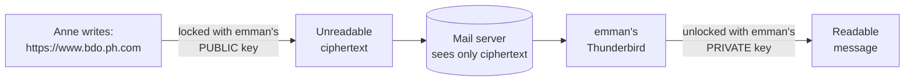

# 🔐 Encrypting Email with OpenPGP in Thunderbird

**A step-by-step, screenshot-guided lab**

*Rivan Cyber Training Institute — Cybersecurity Laboratory*

</div>

---

## 📑 Table of Contents

1. [What You Will Learn](#1-what-you-will-learn)
2. [Key Ideas Before You Start](#2-key-ideas-before-you-start)
3. [Lab Setup](#3-lab-setup)
4. [Part A — Create the Sender's Key (`cs@bdo.ph.com`)](#part-a--create-the-senders-key-csbdophcom)
5. [Part B — Create the Recipient's Key (`emman@bdo.ph.com`)](#part-b--create-the-recipients-key-emmanbdophcom)
6. [Part C — Write and Send an Encrypted Email](#part-c--write-and-send-an-encrypted-email)
7. [Part D — Read the Email as the Recipient](#part-d--read-the-email-as-the-recipient)
8. [Part E — Prove It: Look at the Raw Email](#part-e--prove-it-look-at-the-raw-email)
9. [The Big Picture](#the-big-picture)
10. [Where Do `.asc` Files Fit In?](#where-do-asc-files-fit-in)
11. [Troubleshooting](#troubleshooting)
12. [Check Your Understanding](#check-your-understanding)
13. [Lab Checklist](#lab-checklist)
14. [Glossary](#glossary)

---

## 1. What You Will Learn

By the end of this lab you will be able to:

- ✅ Create an **OpenPGP key pair** (a public key and a private key) inside Thunderbird
- ✅ Explain what the **public key** and the **private key** are each used for
- ✅ Send an **end-to-end encrypted** email from one account to another
- ✅ Read Thunderbird's **security indicators** to confirm a message is encrypted and signed
- ✅ Open the raw email in Notepad and **see the encrypted text** with your own eyes

---

## 2. Key Ideas Before You Start

Take five minutes to read this section. Everything in the lab makes more sense once you understand it.

### 🔑 The padlock analogy

Imagine every person owns a **special padlock** and **one key** that opens it.

- The **open padlock** can be copied and handed out to anyone. Anyone can snap it shut on a box, but nobody can open it again with the padlock alone.
- The **key** is kept secret. Only the owner can open boxes that were locked with their padlock.

That is exactly how OpenPGP works:

| Real world | OpenPGP | Who has it? |
|------------|---------|-------------|
| Open padlock | **Public key** | Shared with everyone |
| The one key | **Private (secret) key** | Only the owner. Never shared. |
| Locking the box | **Encrypting** | Done with the recipient's **public** key |
| Opening the box | **Decrypting** | Done with the recipient's **private** key |

> [!IMPORTANT]
> **Golden rule:** 🔓 *Public key → Encrypt* · 🔐 *Private key → Decrypt*
>
> To send an encrypted email **to emman**, you need **emman's public key**.
> To read an encrypted email **sent to emman**, you need **emman's private key**.

### ✍️ Encrypting vs. signing

OpenPGP does two different jobs. Students often mix them up.

| | **Encryption** | **Digital signature** |
|---|---|---|
| Question it answers | *Who can read this?* | *Who wrote this, and was it changed?* |
| Protects | **Confidentiality** (secrecy) | **Authenticity and integrity** |
| Sender uses | Recipient's **public** key | Sender's **own private** key |
| Receiver uses | Their own **private** key | Sender's **public** key (to verify) |

In this lab Thunderbird will both **encrypt** and **sign** the message, and you will see a separate indicator for each.

### 🗺️ The journey of an encrypted email



Even the mail server, which carries the message, cannot read it. That is what **end-to-end encryption** means: only the two ends (sender and recipient) can see the content.

---

## 3. Lab Setup

This lab uses **one Windows VM** and **one Thunderbird installation** with **two email accounts** inside it. You do not need a second computer.

| Role | Email account | Display name |
|------|---------------|--------------|
| 📤 Sender | `cs@bdo.ph.com` | Anne |
| 📥 Recipient | `emman@bdo.ph.com` | emman |

```text
                 ONE WINDOWS VM
                       │
                       ▼
                ┌─────────────┐
                │ Thunderbird │
                └──────┬──────┘
              ┌────────┴────────┐
              ▼                 ▼
       cs@bdo.ph.com     emman@bdo.ph.com
          SENDER            RECIPIENT
```

> [!NOTE]
> Because both accounts live in the same Thunderbird, both accounts' keys are stored in the same place (Thunderbird's key manager). That is why Thunderbird can find emman's public key automatically in this lab. See [Where Do `.asc` Files Fit In?](#where-do-asc-files-fit-in) for what you would do between two real computers.

---

## Part A — Create the Sender's Key (`cs@bdo.ph.com`)

The sender needs their **own key pair**. Thunderbird uses it to **sign** the messages they send and to **decrypt** messages other people send to them.

### Step 1 — Open Thunderbird and check both accounts

Start the Windows VM and open Thunderbird. In the left panel you should see **both** accounts: `cs@bdo.ph.com` and `emman@bdo.ph.com`.

<p align="center">
  
</p>

**What you're seeing:** Thunderbird's home screen. Each account has its own Inbox, Sent, and Trash folders.

### Step 2 — Open Account Settings

Click the **☰ menu** (three lines, top-right) and choose **Account Settings**.

<p align="center">
  
</p>

### Step 3 — Go to End-To-End Encryption

In the left list, find the `cs@bdo.ph.com` account and click **End-To-End Encryption**. Every account has its own entry with this name.

<p align="center">
 
</p>

You will now see the encryption page. Notice the message next to the key icon:

> *"Thunderbird doesn't have a personal OpenPGP key for **cs@bdo.ph.com**"*

<p align="center">
  
</p>

**What this means:** the account has no key pair yet, so it cannot send signed or encrypted email. Let's fix that.

### Step 4 — Click **Add Key…** and choose *Create a new OpenPGP Key*

<p align="center">
  
</p>

| Option | When to use it |
|--------|----------------|
| **Create a new OpenPGP Key** ✅ | You have never made a key for this email address. **Choose this in the lab.** |
| Import an existing OpenPGP Key | You already have a key for this address (for example from another computer). Creating a new one would make you lose access to old encrypted mail. |

Click **Continue**.

### Step 5 — Choose the key settings

<p align="center">
  
</p>

Set the following:

| Setting | Value | Why |
|---------|-------|-----|
| **Identity** | `anne <cs@bdo.ph.com>` | Ties the key to this name and email address. Always double-check it. |
| **Key expiry** | **3 years** | Keys should not live forever. If one is ever lost or stolen, it stops being valid on its own. You can extend it later. |
| **Key type** | **RSA** | A widely used, well-tested public-key algorithm. |
| **Key size** | **3072 bits** | The "strength" of the key. Bigger is harder to break. 3072 is a strong, modern choice. |

Click **Generate key**.

### Step 6 — Confirm

Thunderbird warns that this can take **several minutes**.

<p align="center">
  
</p>

> [!TIP]
> **Do not close Thunderbird while the key is being generated.** Computers make keys from random numbers, and moving the mouse, browsing, or using the disk gives Thunderbird more randomness to work with, which speeds things up.

Click **Confirm** and wait.

### Step 7 — Success! Your sender now has a key

<p align="center">
  
</p>

The green banner **"OpenPGP Key created successfully!"** confirms it. Thunderbird also shows the **Key ID**: a short label that identifies this key. In our screenshot it is `0x8B85C0C6C8B789E5`. (Yours will be different. Every key ID is unique.)

Two more things to notice on this screen:

- The key is selected as the one to use for this account. Leave it selected.
- There is a **Publish** button that uploads your *public* key to a public keyserver. **You do not need it in this lab. Do not click it.**

> [!NOTE]
> ✅ **Result of Part A:** `cs@bdo.ph.com` now owns a key pair: a public key (shareable) and a private key (secret).

---

## Part B — Create the Recipient's Key (`emman@bdo.ph.com`)

Now we do the **same thing for the recipient**. This is important: emman needs a key pair so that **(1)** the sender has a public key to encrypt with, and **(2)** emman has a private key to decrypt with.

### Step 8 — Open End-To-End Encryption for the *emman* account

In Account Settings, this time select **End-To-End Encryption** under **`emman@bdo.ph.com`**.

<p align="center">
  
</p>

> [!WARNING]
> **Check the account name** in the message ("…for **emman@bdo.ph.com**"). Making a key while the wrong account is selected is one of the most common mistakes in this lab.

### Step 9 — Add a new key

Click **Add Key…**, keep **Create a new OpenPGP Key** selected, and click **Continue**.

<p align="center">
 
</p>

### Step 10 — Use the same settings as before

<p align="center">
  
</p>

| Setting | Value |
|---------|-------|
| Identity | `emman <emman@bdo.ph.com>` |
| Key expiry | 3 years |
| Key type | RSA |
| Key size | 3072 |

Click **Generate key → Confirm**, and wait for the green success message, just like in Part A.

> [!NOTE]
> ✅ **Result of Part B:** both accounts now have their own key pairs.
>
> | Account | Public key | Private key |
> |---------|-----------|-------------|
> | `cs@bdo.ph.com` | ✔ | ✔ |
> | `emman@bdo.ph.com` | ✔ | ✔ |

---

## Part C — Write and Send an Encrypted Email

### Step 11 — Switch to the sender's account

In the left panel, click the **`cs@bdo.ph.com`** account. You will see its home page with links such as *Read messages*, *Write a new message*, and *End-to-end Encryption*.

<p align="center">
  
</p>

Click **Write a new message** (or the blue **New Message** button).

### Step 12 — Fill in the email

<p align="center">
  
</p>

| Field | Value |
|-------|-------|
| **From** | `anne <cs@bdo.ph.com>` |
| **To** | `emman@bdo.ph.com` |
| **Subject** | `Email Encrypted` |
| **Body** | `https://www.bdo.ph.com` (or the website your instructor asks you to test with) |

### Step 13 — Read the blue banner at the bottom

Look at the bottom of the compose window:

> ℹ️ *"OpenPGP end-to-end encryption is possible."*

This is **good news**. It means Thunderbird found a usable **public key for emman@bdo.ph.com** and is offering to use it. There is also an **Encrypt** button on that banner.

> [!WARNING]
> If you instead see **"Cannot Encrypt — No key available"**, Thunderbird cannot find emman's public key. Go to [Troubleshooting](#troubleshooting).

### Step 14 — Turn encryption on

Click the **Encrypt** button in the toolbar (or in the banner). When encryption is on, the button looks **pressed in**, like this:

<p align="center">
  
</p>

### Step 15 — Send

Before you click **Send**, do a quick check:

- ✔ From = `cs@bdo.ph.com`
- ✔ To = `emman@bdo.ph.com`
- ✔ The **Encrypt** button is pressed in

Then click **Send**.

**What happens behind the scenes:**

1. Thunderbird takes your message.
2. It locks it with **emman's public key**, so now **only emman's private key can unlock it**.
3. It also **signs** the message with **Anne's private key**, so emman can verify who sent it.
4. It hands the locked message to the mail server.

---

## Part D — Read the Email as the Recipient

### Step 16 — Open emman's inbox

Click **Inbox** under `emman@bdo.ph.com` and select the newest message, **"Email Encrypted"** from Anne.

<p align="center">
  
</p>

You will notice something that surprises many students: **the message is perfectly readable.**

> [!IMPORTANT]
> **Readable does not mean it was sent as plain text.**
> Because emman's **private key is stored in this same Thunderbird**, Thunderbird **automatically decrypts** the message for you the moment you open it. If emman were on a different computer *without* the private key, this message would look like scrambled text.

You can see the proof at the top-right of the message header, next to the word **OpenPGP**:

| Icon | Meaning |
|------|---------|
| 🔒 with a ✔ | The message **was encrypted** and was decrypted successfully |
| 🏅 badge / ribbon | The message carries a **digital signature** |

*(Older test messages from earlier attempts may also be in your inbox. Ignore them.)*

### Step 17 — Open the security details

Click the **OpenPGP** icons in the message header. A **Message Security — OpenPGP** panel opens:

<p align="center">
  
</p>

Here is how to read it, section by section:

| Section | What it says | What it means |
|---------|--------------|---------------|
| **Good Digital Signature** | *Signer key ID: 0x8B85C0C6C8B789E5* | The signature is valid, so the message really came from the owner of that key and was **not altered** on the way. |
| **Message Is Encrypted** | *Encryption ensures the message can only be read by the recipients it was intended for.* | The content was locked before being sent. |
| **Your decryption key ID** | *0x8B85C0C6C8B789E5 (Sub key ID: 0xE243C64C5A93D0AA)* | The **private key** Thunderbird used to unlock this copy. |
| **Encrypted to the owners of the following keys** | *emman <emman@bdo.ph.com> 0x9A1C3BF03B5A4FB1* | The list of **public keys** the message was locked for. emman is on it, which proves the sender used **emman's public key**. |

> [!NOTE]
> 🔍 **Look closely at this screenshot.** The *Signer key ID* and the *decryption key ID* are the **same** (`0x8B85…`), and that is Anne's key (`cs@bdo.ph.com`), while emman is listed under "encrypted to the owners of the following keys."
> This tells us this panel was opened on the **sender's own copy** of the message. Thunderbird always encrypts a copy of every outgoing message to the **sender's own key** as well, so the sender can still read their **Sent** mail later.
> When you open the panel on the message in **emman's** inbox, expect the *decryption key* to be **emman's** key (`0x9A1C3BF03B5A4FB1`) instead. Try both and compare.

---

## Part E — Prove It: Look at the Raw Email

Thunderbird showed you readable text, but is the email *really* encrypted while it travels? Let's look at the message **without** Thunderbird's decryption help. Notepad has no private key, so whatever it shows is what the mail server and anyone in between would see.

### Step 18 — Save the message to a file

Open the message, **right-click** inside the message body, and choose **Save As…**.

<p align="center">
  
</p>

### Step 19 — Choose where to save it

<p align="center">
  
</p>

Save it in your **Documents** folder. The **Save as type** list offers *Mail Files*, *HTML Files*, *Text Files*, and *All Files*. You can also see the earlier `CS-public.asc` and `emman-public.asc` key files in this folder (see [the `.asc` section](#where-do-asc-files-fit-in)).

### Step 20 — Open it with Notepad

Open **File Explorer**, right-click the file you just saved, choose **Open with → Notepad**.

<p align="center">
  
</p>

### Step 21 — Read the top of the file: the headers

<p align="center">
    
</p>

| Line | What it tells you |
|------|-------------------|
| `From: anne <cs@bdo.ph.com>` / `To: emman@bdo.ph.com` | **Headers are not encrypted.** The mail server needs to know where to deliver the message, so sender, recipient and date stay visible. |
| `Subject: ...` | Notice the real subject **"Email Encrypted" is not shown**. Thunderbird hides it and puts the true subject inside the encrypted part. |
| `Autocrypt: addr=cs@bdo.ph.com; keydata=…` | A copy of the **sender's public key** travels in the header. This lets the recipient's mail program automatically learn the sender's public key so it can reply encrypted. |
| `Content-Type: multipart/encrypted;` | The email's label says it plainly: **the body is encrypted.** |

### Step 22 — Scroll down: the encrypted body

<p align="center">
  
</p>

<p align="center">
  
</p>

Everything between

```text
-----BEGIN PGP MESSAGE-----
```

and

```text
-----END PGP MESSAGE-----
```

is the **ciphertext**, meaning your message after encryption. Can you find `https://www.bdo.ph.com` anywhere in it? **No.** Without emman's private key, it is just a wall of random-looking characters.

> [!IMPORTANT]
> 🎯 **This is the real proof.** Thunderbird shows readable text only because it holds the private key and decrypts on the fly. What actually travelled across the network, and what sits on the mail server, is the scrambled block you just saw.

---

## The Big Picture

```text
 SENDER SIDE                                              RECIPIENT SIDE
 ───────────                                              ──────────────

 Anne types the message
        │
        ▼
 Thunderbird ENCRYPTS it with           ┌───────────────────┐
 emman's PUBLIC key            ───────► │  -----BEGIN PGP   │ ───────►  Thunderbird DECRYPTS it
        │                               │  MESSAGE-----     │           with emman's PRIVATE key
        ▼                               │  (unreadable)     │                    │
 Thunderbird SIGNS it with              └───────────────────┘                    ▼
 Anne's PRIVATE key                       travels over the             Readable message +
                                          internet / mail server       "Good Digital Signature"
                                                                       (checked with Anne's PUBLIC key)
```

| Action | Which key? |
|--------|-----------|
| Anne **encrypts** to emman | emman's **public** key |
| emman **decrypts** | emman's **private** key |
| Anne **signs** | Anne's **private** key |
| emman **verifies** the signature | Anne's **public** key |
| emman replies **encrypted** to Anne | Anne's **public** key |
| Anne **decrypts** the reply | Anne's **private** key |

---

## Where Do `.asc` Files Fit In?

You may have noticed files ending in **`.asc`**. That extension just means the content is stored as **plain, copy-and-paste-friendly text** ("ASCII armor"). What is *inside* can be different things:

| File / place | What it contains | Safe to share? |
|--------------|------------------|----------------|
| `emman-public.asc`, `CS-public.asc` | A person's **public key** | ✅ Yes, that is its purpose |
| An attachment like `OpenPGP_0x….asc` on a received email | The **sender's public key**, attached automatically so you can reply encrypted | ✅ Yes |
| `filename="encrypted.asc"` inside the raw email (Step 22) | The **encrypted message itself** | ✅ It is unreadable without the private key |
| A file containing a **secret/private key** | Your **private key** | ❌ **Never share.** |

> [!TIP]
> **In this lab**, both accounts share one Thunderbird, so Thunderbird already knows emman's public key and no file transfer is needed.
> **Between two real people or computers**, emman would **export** his public key to a `.asc` file (Thunderbird: *OpenPGP Key Manager → select the key → Export Public Key(s)*), send it to Anne, and Anne would **import** it into her Thunderbird. Only then could she encrypt to emman.

---

## Troubleshooting

<details>
<summary><strong>❌ "Cannot Encrypt — No key available" when I press Encrypt</strong></summary>

Thunderbird cannot find a usable **public key** for the recipient's address.

- Check that the recipient address is **exactly** `emman@bdo.ph.com` (no typos).
- Make sure **Part B** was completed and emman's key was created successfully.
- Open **OpenPGP Key Manager** and confirm a key exists for `emman@bdo.ph.com` and that it has **not expired**.
- If the key came from a file, import the **public** key (`.asc`) into the sender's Thunderbird.

</details>

<details>
<summary><strong>❌ The Encrypt button is greyed out or missing</strong></summary>

Check that: the **sender** has a personal key, the **recipient** has a public key available, the address is typed correctly, and neither key is expired.

</details>

<details>
<summary><strong>🤔 The received email is readable. Is it really encrypted?</strong></summary>

Yes, if you see the 🔒 icon and the security panel says **Message Is Encrypted**. Thunderbird decrypts automatically because the private key is available. Do [Part E](#part-e--prove-it-look-at-the-raw-email) to see the encrypted version.

</details>

<details>
<summary><strong>❌ I created a key for the wrong account</strong></summary>

Open **OpenPGP Key Manager**, check which email address the key belongs to, and delete only the wrong key, then repeat the steps for the correct account. Always read the identity line in the *Generate OpenPGP Key* dialog before clicking **Generate key**.

</details>

<details>
<summary><strong>⏳ Key generation is taking very long</strong></summary>

This is normal. It can take several minutes. Keep Thunderbird open and keep using the computer (moving the mouse, opening folders) to give it more randomness.

</details>

<details>
<summary><strong>🔐 Should I click "Publish" to upload my key?</strong></summary>

Not in this lab. Publishing places your public key on a public keyserver for anyone to find, and it is difficult to undo. It is unnecessary for a practice exercise.

</details>

---

## Check Your Understanding

Try to answer these before opening the answers.

**1.** Anne wants to send an encrypted email to emman. Which key does she use to encrypt it?

<details><summary>Answer</summary>

**emman's public key.**

</details>

**2.** Which key does emman use to read it?

<details><summary>Answer</summary>

**emman's private key.**

</details>

**3.** The message looks perfectly normal in emman's inbox. Does that mean it was sent unencrypted?

<details><summary>Answer</summary>

No. Thunderbird decrypted it automatically because emman's private key is stored locally. The lock icon and the *Message Is Encrypted* panel confirm it was encrypted.

</details>

**4.** In the raw email, which parts are still readable to a mail server, and which part is not?

<details><summary>Answer</summary>

Headers such as **From, To, and Date** are readable because the server needs them to deliver mail. The **body** (between `BEGIN PGP MESSAGE` and `END PGP MESSAGE`) is unreadable ciphertext. The subject is also hidden (`Subject: ...`).

</details>

**5.** What is the difference between *encrypting* and *signing*?

<details><summary>Answer</summary>

**Encrypting** keeps the content **secret** (only the recipient can read it). **Signing** proves **who sent it** and that it **wasn't changed**. Encryption uses the recipient's public key. Signing uses the sender's private key.

</details>

**6.** Is it safe to email your `.asc` public-key file to a friend? What about your private key?

<details><summary>Answer</summary>

Sharing the **public** key is safe. That is what it is for. The **private** key must **never** be shared.

</details>

---

## Lab Checklist

- [ ] Opened Thunderbird and confirmed both accounts (`cs@bdo.ph.com`, `emman@bdo.ph.com`)
- [ ] Created an OpenPGP key pair for `cs@bdo.ph.com` (RSA, 3072 bits, 3 years)
- [ ] Created an OpenPGP key pair for `emman@bdo.ph.com` (RSA, 3072 bits, 3 years)
- [ ] Wrote a new message from `cs@bdo.ph.com` to `emman@bdo.ph.com`
- [ ] Saw the banner **"OpenPGP end-to-end encryption is possible"**
- [ ] Turned on **Encrypt** and sent the message
- [ ] Opened the message in emman's inbox and saw the 🔒 encryption icon
- [ ] Opened the **Message Security — OpenPGP** panel and explained each section
- [ ] Saved the message and opened it in Notepad
- [ ] Found `-----BEGIN PGP MESSAGE-----` and confirmed the text is unreadable
- [ ] Can explain: *public key → encrypt, private key → decrypt*

---

## Glossary

| Term | Meaning |
|------|---------|
| **OpenPGP** | An open standard for encrypting and signing messages using key pairs. |
| **Public key** | The shareable half of a key pair. Used to **encrypt** to its owner and to **verify** the owner's signatures. |
| **Private (secret) key** | The secret half. Used to **decrypt** and to **sign**. Never share it. |
| **Key pair** | A public key and private key created together. |
| **Key ID / Fingerprint** | Short labels that identify a key, useful for confirming you have the right one. |
| **Encryption** | Scrambling a message so only the intended recipient can read it. |
| **Decryption** | Turning the scrambled message back into readable text. |
| **Ciphertext** | The scrambled, unreadable result of encryption. |
| **Digital signature** | A value made with the sender's private key that proves who sent a message and that it was not altered. |
| **End-to-end encryption** | Only the sender and recipient can read the message. The mail server cannot. |
| **RSA** | The public-key algorithm used in this lab. |
| **ASCII armor / `.asc`** | A text format for keys and encrypted data so they can be copied, pasted or emailed. |
| **Keyserver** | A public directory where people can publish their public keys. |

---

<div align="center">

*Rivan Cyber Training Institute — Cybersecurity Laboratory*
*Thunderbird · OpenPGP · Email Security*

</div>
